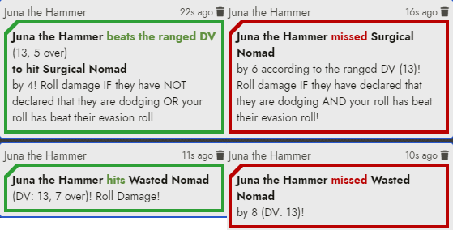
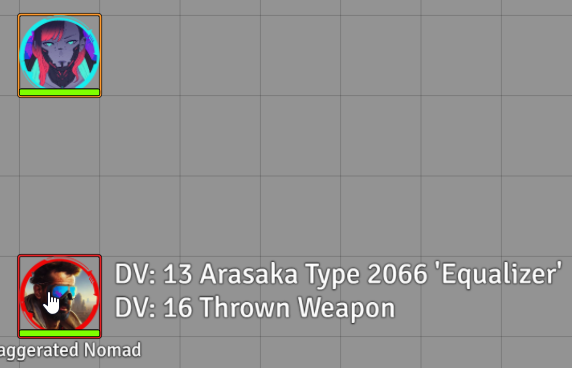
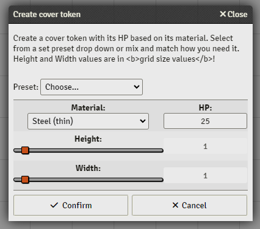

# Diwako's Cyberpunk Red - Core Additions

A small module to add some more features to the Cyberpunk Red - Core system until these features are either added to the system itself or other wise.

## Requirements

[LibWrapper](https://foundryvtt.com/packages/lib-wrapper)

## Features

### "Does it hit?"

A small feature to check if a ranged attack hits its mark. It outputs a chat message, with color codes, and with extra information about the attack. Useful if you need to know how much your shot was off, or how much it is over the DV (useful for autofire).

It takes the REF value into account of the target. Meaning it will remind everyone the target can dodge bullets.

Make sure to tell your players and yourself to target the token you want to attack!

### Hit sounds

**REQUIRES THE [SEQUENCER MODULE](https://github.com/fantasycalendar/FoundryVTT-Sequencer)**

For some reason my players wanted funny sounds when a token manages to hit another in ranged combat. So that option was added.

### Hit and miss animations

**REQUIRES THE [SEQUENCER MODULE](https://github.com/fantasycalendar/FoundryVTT-Sequencer) AND [JB2A PATREON MODULE](https://www.patreon.com/JB2A/)**

Displays the "Miss" animation most people know from XCOM2 and onwards. On hit it plays the bludgeoning effect from JB2A.

Do note this feature is not for gun fire effects, this is covered by the Automated Animations module and custom configuration files!

### DV Display

Have your character's token selected and hover over another token to show the DVs you'd need to beat for all your currently equipped ranged weapons. Supports upgrade items like underslung grenade launcher, cyber weapons like pop up launchers. By default shows only during combat encounters, but can be displayed any time with a setting.

Can either show weapon names, or weapon types. Text can be displayed left or right of the hovered token. All configurable via game settings.

### Cover Tokens

Inside this module a new macro has been shipped called `Create Cover`. This macro will create a token with HP according to the material list found in the core rule book. Several presets for easier selection are provided as well. These tokens are invisible to players by default, but a setting has been added to make them visible upon creation.

This feature will create a dummy actor called `Cover Helper` which the GM can just put into a folder and forget. Deletion of the actor is fine as well, the macro would create a new one if there is a need for it again.

### Poor Weapon Check

In Cyberpunk Red, poor weapons can jam or break when the attacker rolls a 1 on the first D10. This feature shows a reminder message in the text chat that a poor weapon just jammed or broke.

The feature can be turned off by the GM, it is default enabled.

**Make sure poor quality weapons have the identifier `(Poor)` or language equivalent in its item name!**

### Item Piles Module features

[Items Piles](https://github.com/fantasycalendar/FoundryVTT-ItemPiles/) is great, I fully recommend that module, sadly it can break character sheets if you drop, store, or sell an upgraded item using an Item Piles functionality.

Thus if this module detects you dropping an upgraded item it will prevent the action.

If you do not run Item Piles, don't worry this module will do nothing then.

## Known Issues

The CPRED - Core system does not provide speaker data on chat messages for players. The module will try to get the attacker token through various ways, but if the token you are attacking with has a different name than your character AND prototype token, this will not work. For the GM it will work just fine, as required data is being sent.

Only DV tables from the system's compendium are used. Custom ones are currently not supported.

DV Display and "Does it hit" can only work if a weapon has a DV table configured.
